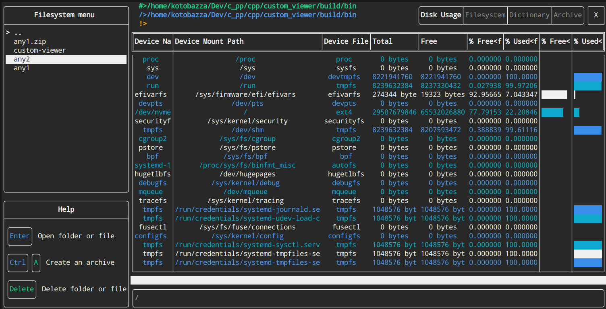

# custom-viewer

**Forked by [temt](https://github.com/kotobazza/temt)**

Простая TUI утилита для:
+ просмотра информации о хранилище
+ управления файлами и архивами 
+ сериализации и десериализации объекта дневника в JSON и XML

## Установка
1. `git clone https://github.com/kotobazza/custom_viewer.git`
2. `mkdir build && cd build`
3. `cmake ..`
4. `make` 

## Используемые библиотеки
+ [Boost](https://github.com/boostorg/boost)
    + property-tree
+ [libarchive](https://github.com/libarchive/libarchive)
+ [FTXUI](https://github.com/ArthurSonzogni/FTXUI)

